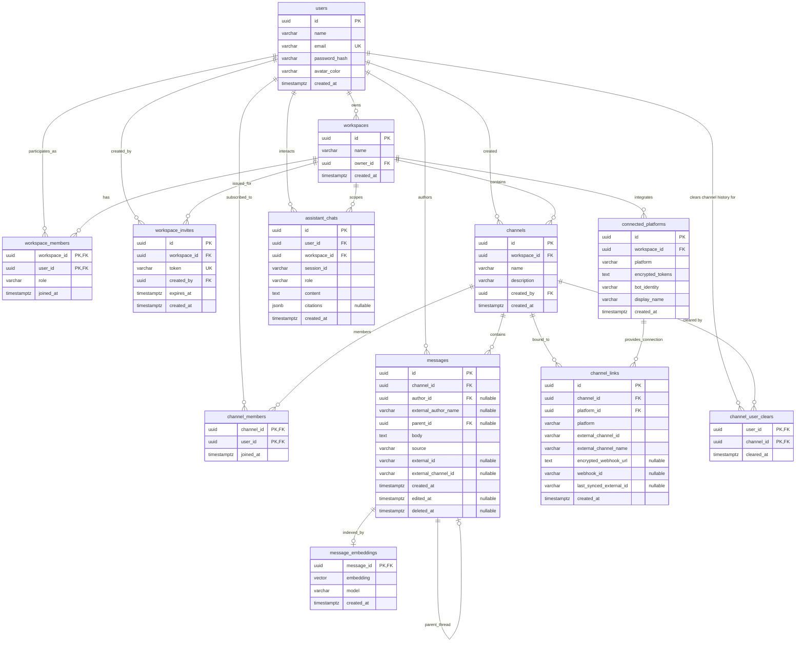

# UniChat Entity Relationship Diagram

```mermaid
erDiagram
    users ||--o{ workspaces : "owns"
    users ||--o{ workspace_members : "participates_as"
    users ||--o{ workspace_invites : "created_by"
    users ||--o{ channel_members : "subscribed_to"
    users ||--o{ channels : "created"
    users ||--o{ messages : "authors"
    users ||--o{ assistant_chats : "interacts"

    workspaces ||--o{ workspace_members : "has"
    workspaces ||--o{ workspace_invites : "issued_for"
    workspaces ||--o{ channels : "contains"
    workspaces ||--o{ connected_platforms : "integrates"
    workspaces ||--o{ assistant_chats : "scopes"

    channels ||--o{ channel_members : "members"
    channels ||--o{ messages : "contains"
    channels ||--o{ channel_links : "bound_to"

    connected_platforms ||--o{ channel_links : "provides_connection"

    messages ||--o| messages : "parent_thread"
    messages ||--o| message_embeddings : "indexed_by"

    users {
        uuid id PK
        varchar name
        varchar email UK
        varchar password_hash
        varchar avatar_color
        timestamptz created_at
    }

    workspaces {
        uuid id PK
        varchar name
        uuid owner_id FK
        timestamptz created_at
    }

    workspace_members {
        uuid workspace_id PK, FK
        uuid user_id PK, FK
        varchar role
        timestamptz joined_at
    }

    workspace_invites {
        uuid id PK
        uuid workspace_id FK
        varchar token UK
        uuid created_by FK
        timestamptz expires_at
        timestamptz created_at
    }

    channels {
        uuid id PK
        uuid workspace_id FK
        varchar name
        varchar description
        uuid created_by FK
        timestamptz created_at
    }

    channel_members {
        uuid channel_id PK, FK
        uuid user_id PK, FK
        timestamptz joined_at
    }

    messages {
        uuid id PK
        uuid channel_id FK
        uuid author_id FK "nullable"
        varchar external_author_name "nullable"
        uuid parent_id FK "nullable"
        text body
        varchar source
        varchar external_id "nullable"
        varchar external_channel_id "nullable"
        timestamptz created_at
        timestamptz edited_at "nullable"
        timestamptz deleted_at "nullable"
    }

    connected_platforms {
        uuid id PK
        uuid workspace_id FK
        varchar platform
        text encrypted_tokens
        varchar bot_identity
        varchar display_name
        timestamptz created_at
    }

    channel_links {
        uuid id PK
        uuid channel_id FK
        uuid platform_id FK
        varchar platform
        varchar external_channel_id
        varchar external_channel_name
        text encrypted_webhook_url "nullable"
        varchar webhook_id "nullable"
        varchar last_synced_external_id "nullable"
        timestamptz created_at
    }

    message_embeddings {
        uuid message_id PK, FK
        vector embedding
        varchar model
        timestamptz created_at
    }


    channel_user_clears {
        uuid user_id PK,FK
        uuid channel_id PK,FK
        timestamptz cleared_at
    }

    users ||--o{ channel_user_clears : "clears channel history for"
    channels ||--o{ channel_user_clears : "cleared by"

    assistant_chats {
        uuid id PK
        uuid user_id FK
        uuid workspace_id FK
        varchar session_id
        varchar role
        text content
        jsonb citations "nullable"
        timestamptz created_at
    }
```
